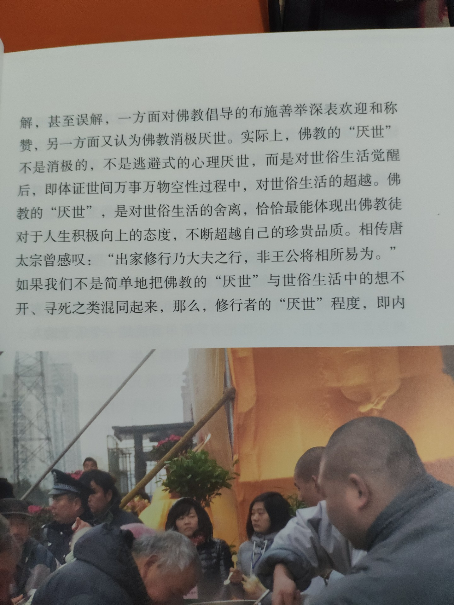

演讲中，宿华表示：“大家看到的这个世界是由所有人呈现的，而历史上我们看到的世界是由少数人呈现的。今天所有人一起参与呈现这个世界，当我们以这样的方式去观察和感知这世界的时候，背后有一些新的社会问题其实就出现了。”

谈及乌镇世界互联网大会上几场饭局，王坚表示，一个世界级的大会，媒体写的却都是关于“饭局”的事情，这是不对的。能够解决未来的问题的，不是所谓的成功人士，而是年轻

常常听人<size>说：＂没文化，真可怕＂。</size>可＂文化＂到底是什么呢？是学历，是经历，是阅历，都不是。 看到网上一个很靠谱的解释，说文化可以用四句话表达： <size>根植于内心的修养； 无需提醒的自觉； 以约束为前提的自由； 为别人着想的善良！</size>

昨天，南京师范大学教授、央视《百家讲坛》主讲人郦波作客扬州讲坛，以“儒释道中的人生智慧”为题，提出人生三大困惑：欲望、情绪、习性，并在儒释道哲学精华中寻求对应的答案。两个半小时的讲座，郦波妙语连珠，名人典故信手拈来，真知灼见流溢其间，现场不时响起热烈的掌声。
人生“三困”之一：欲望
贪婪与占有是人性本能，物种生存需要占有资源来保障，但当这种欲望无限制地发展下去，就形成了人的各种私欲。
【哲思应对】
道教：超脱改变维度，将欲望上升到价值
在解决欲望的问题上，儒家出乎其内，佛家出乎其外，道家超乎其上。如庄子的《逍遥游》，鲲为何怒而高飞？因为它想挣脱一切束缚的自由。
而《庄子·秋水篇》最后，记录着庄子和惠子关于“知鱼之乐”的辩论，庄子虽输掉辩论，却用其来升华全篇，也更说明了何为道家的超脱。
再如，走出迷宫最好的办法是到迷宫上方，让你比迷宫多一个维度。这就是道家解决问题的一个大智慧：要么比问题多一个维度，要么让问题少一个维度，道家终将欲望上升到价值。
人生“三困”之二：情绪
人生的第二大困惑便是情绪，许多社会问题便是信仰缺失后，导致情绪失控，从而失去理性判断和价值判断。
【哲思应对】
佛教：戒、定、慧“三大法门”静心养性
解决情绪问题佛家有大智慧，佛家三大法门：戒、定、慧。如六祖慧能“菩提本无树，明镜亦非台，本来无一物，何处惹尘埃”这是一种出世的态度。再如，六祖慧能归岭南后，于唐高宗仪凤元年（676年）正月初八到广州法性寺。印宗法师在该寺内讲《涅槃经》之际，有风吹幡动，一僧曰：风动；一僧曰：幡动；争论不休。六祖慧能说：“非风动，非幡动，仁者心动。”这风动幡动就是外在情绪，心动心乱是因为自己的心像黄河水一样浑浊。如何使黄河之水变清？用杯子舀一杯，静一静。而佛教的规范、戒律等也会让心从万丈红尘中抽离出来。
人生“三困”之三：习性
比情绪更困扰人生的是习性，你现在的一切都是习性造成的。
【哲思应对】
儒家：知行合一，学习中养成行为、思维习惯
儒家的精华，即最核心的三句话就是“学而时习之不亦说乎”“有朋自远方来不亦乐乎”“人不知而不愠不亦君子乎”，分别讲述了个体成长、团队的成长和社会的价值及底线。
儒家以学习为乐，在学习中培养行为、思维习惯及价值追求，也就是“知行合一”。从知到行、从行到合、从合到一，其中最关键的便是“合”字，简而言之就是专注力。事上磨、事上练，在纷繁复杂的具体事务
欲望  情绪 习性

广义的“品牌”是具有经济价值的无形资产，用抽象化的、特有的、能识别的心智概念来表现其差异性，从而在人们的意识当中占据一定位置的综合反映。品牌建设具有长期性。
狭义的“品牌”是一种拥有对内对外两面性的“标准”或“规则”，是通过对理念、行为、视觉、听觉四方面进行标准化、规则化，使之具备特有性、价值性、长期性、认知性的一种识别系统总称。这套系统我们也称之为CIS（corporate identity system）体系。
现代营销学之父科特勒在《市场营销学》中的定义，品牌是销售者向购买者长期提供的一组特定的特点、利益和服务。
品牌是给拥有者带来溢价、产生增值的一种无形的资产，它的载体是用于和其他竞争者的产品或劳务相区分的名称、术语、象征、记号或者设计及其组合，增值的源泉来自于消费者心智中形成的关于其载体的印象。
品牌承载的更多是一部分人对其产品以及服务的认可，是一种品牌商与顾客购买行为间相互磨合衍生出的产物。
中文名
品牌
外文名
Brand
拼音
pǐnpái
定义
具有经济价值的无形资产
定义
具有高远影响的效应价值

但是，怀疑他自己的存在则是不可能的，因为如果他不存在的话，就没有魔鬼能够骗他。如果他怀疑，那么他就必然存在；如果他有过什么经验，那么他也必然存在。 

君子如水，随方就圆，无处不自在。

初闻不知曲中意，在听已是曲中人
心如果是阳光的，就能照亮你的世界，你的视野也会宽广，就会看到不一样的风景。